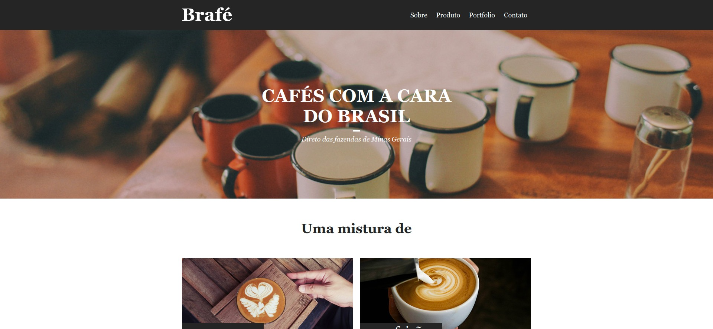

<h1 align="center">
  
</h1>

<h3 align="center">
  Curso realizado na origamid - Edu Souza o/
</h3>

<blockquote align="center">“O sábio nunca diz tudo o que pensa, mas pensa sempre tudo o que diz.
- Aristóteles”</blockquote>

<h4 align="center">
  Repositório - CSS Avançado Posicionamento
</h4>

 

  &nbsp;
  &nbsp;
  

  <a href="#rocket-Sobre-o-curso">Sobre o curso</a>&nbsp; &nbsp; |&nbsp; &nbsp; 
  <a href="#-Tecnologias">Tecnologias</a>&nbsp; &nbsp; |&nbsp; &nbsp; 
  <a href="#postbox-Entrega">Entrega</a>&nbsp; &nbsp; |&nbsp; &nbsp; 
  <a href="#unlock-Licença">Licença</a>

 

## :rocket: Sobre o curso

#### CSS Avançado Posicionamento

No curso de CSS Avançado – Posicionamento você irá aprender a partir dos fundamentos como posicionar os elementos em uma página. O foco é passar de maneira exaustiva os fundamentos das propriedades e como elas agem no layout do site.

Serão criados 3 projetos diferentes durante o curso. Cada um dos projetos será codificado utilizando 4 maneiras diferentes. A primeira da forma mais pura possível, definindo width’s e height’s, a segunda com um sistema de grid pré definido, a terceira com o Flexbox e por último usando o Bootstrap.

#### Screenshots:

   &nbsp; &nbsp; 
  

 

##  Tecnologias

Esse projeto foi desenvolvido com as seguintes tecnologias:

<table >
  <tr>
    <td align=center><a href="https://developer.mozilla.org/pt-BR/docs/Web/HTML">
HTML
</a></td>
      <td align=center><a href="https://developer.mozilla.org/pt-BR/docs/Web/CSS">
CSS
</a> </td>
        <td align=center><a href="https://developer.mozilla.org/pt-BR/docs/Web/JavaScript">
Javascript
</a></td>
  </tr>
</table>

 

## :postbox: Entrega

#### Concluido :clipboard:

Acima, nos arquivos você encontra as quatros formas de estilos css implementas o/.
Acesse o deploy do projeto [aqui](https://edusouza-programmer.github.io/css_avancado-origamid/).

# 
## :unlock: Licença

Este projeto está licenciado sob a Licença MIT - consulte [LICENSE](https://opensource.org/licenses/MIT) para maiores detalhes.
